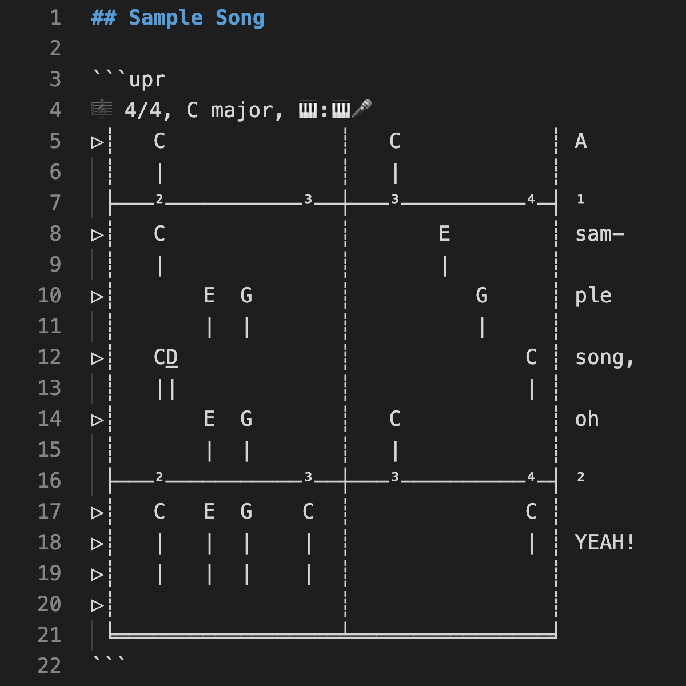
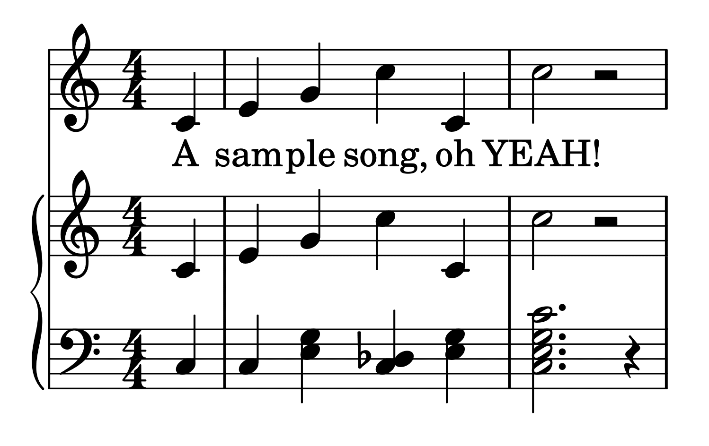
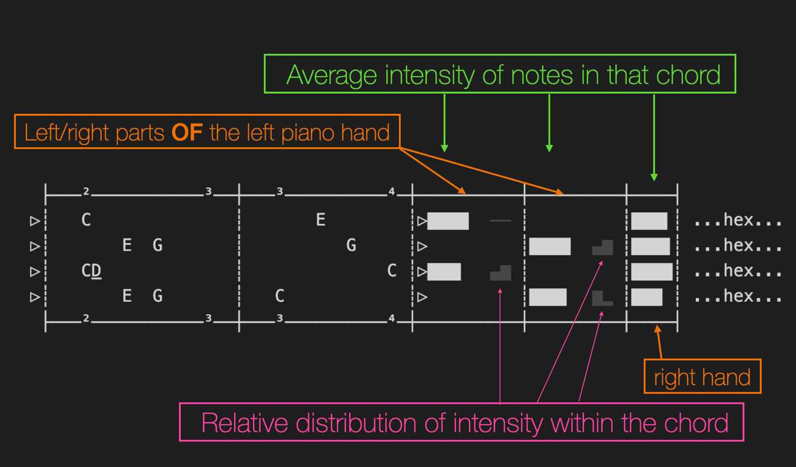

# Unicode Piano Roll (UPR) language

## Scores

|                                                                                   |                                                                   |
| --------------------------------------------------------------------------------- | ----------------------------------------------------------------- |
|  |  |

...wherein:

- `D̅` is single-column shorthand for `D♯`
- `D̲` is single-column shorthand for `D♭`

## Performances

Unicode Piano Roll can also express performances of scores, where each note in the score is given a timestamp and an intensity value.

- Each timestamp is on a discrete time scale of whatever precision you choose

- Each note intensity is an integer in the range [0, 127] (for now)

In addition to those precise numbers (encoded as hex of varints of deltas), a visual overview of the note intensities is included:

This makes use of codepoints from the Block Elements block of Unicode, so:

- Showing a chord's _average intensity_ can use four glyphs per note (e.g. `███▌`) to express the intensity with 32-possible-values precision

- Showing a chord's _relative distribution_ of intensity can use one glpyh per note in the chord (with 8 possible vertical values each). For example, `▄▇` shows at a glance that the higher note in this 2-note chord is about 40% more intense.

You will also, optionally, be able to include a visualization of each note's delta between when it was predicted to be played and when it was actually played.

(predicted based on the score plus the context of the performance up to that point)

## Recommended filenames

|                                         |                                                                                          |
| --------------------------------------- | ---------------------------------------------------------------------------------------- |
| `My_awesome_composition.upr.txt`        | when you save a score as normal plain text (UTF-8)                                       |
| `My_awesome_composition.upr.artc`       | when you save a score as an [`.artc` file](https://artcformat.org/) (with the same info) |
| `My_awesome_composition-take1.upr.txt`  | when you save a performance as normal plain text (UTF-8)                                 |
| `My_awesome_composition-take1.upr.artc` | when you save a performance as an [`.artc` file](https://artcformat.org/)                |
